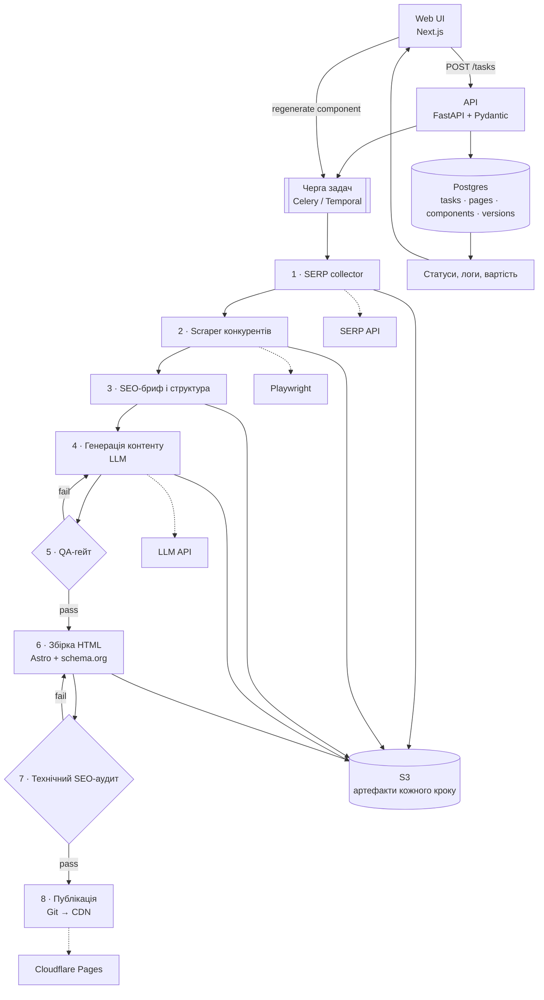

# Завдання 1. Автоматизований генератор SEO-сайтів

Технічний план. Код не пишеться.

## Схема архітектури

Ключовий принцип: **кожен крок — окремий ідемпотентний воркер**, який читає вхідні артефакти з S3, пише вихідні туди ж і оновлює стан у Postgres. Тому будь-який етап можна перезапустити окремо, не проганяючи весь ланцюг.

## Як працює система

**1. Прийом і валідація задачі.** Форма приймає: ключове слово, гео, мову, тип сторінки, домен, тон, обмеження. Валідація в два шари — схема (Pydantic) і бізнес-правила: чи не дублюється ключ у вже згенерованих сайтах, чи є бюджет, чи дозволена тематика. Задача створюється зі станом `queued` і повертає `task_id`.

**2. Отримання SERP.** Через SERP API-провайдера (SerpAPI / DataForSEO), а не власний скрапінг. Параметри: `q`, `gl`, `hl`, `device`, `num=20`. Сирий JSON кладеться в S3 і кешується на 7 днів за ключем `keyword+geo+device` — при тисячах сайтів це найбільша економія бюджету.

**3. Збір даних конкурентів.** Обходимо топ-10: заголовки H1–H3, обсяг тексту, сутності й терміни, FAQ, наявність таблиць і схем, Schema.org-типи, мета-теги, внутрішні посилання. Playwright для JS-сайтів, trafilatura для чистого тексту. Дані потрібні для двох речей: визначити **очікувану структуру** сторінки (що Google уже винагороджує в цій ніші) і **порогові вимоги** — медіанний обсяг, обов'язкові підтеми.

**4. Формування структури і брифу.** Агрегація детермінована, не LLM: кластеризація заголовків конкурентів, частотність підтем, медіана обсягу. LLM додається лише щоб згрупувати схожі заголовки й запропонувати назви розділів. На виході — JSON-бриф: дерево заголовків, обов'язкові сутності, цільовий обсяг на секцію, тип кожного компонента, вимоги до мета-тегів.

**5. Генерація контенту і контроль якості.** Генеруємо **посекційно**, а не сторінку цілком: кращий контроль, дешевші повтори. Вивід — структурований JSON із прив'язкою до компонента брифу. QA-гейт комбінує детерміновані перевірки (обсяг, покриття сутностей, щільність ключа, унікальність через shingles проти власної бази і зовнішнього плагіат-API, заборонені твердження, битий Markdown) і LLM-as-judge за рубрикою (відповідність брифу, фактологічна обґрунтованість, читабельність). Провал → повтор секції з фідбеком, максимум 2 спроби, далі — на ручний розгляд.

**6. Технічна SEO-розмітка.** HTML збирається зі шаблонів (Astro), а не генерується LLM — це прибирає цілий клас помилок. Валідатор перевіряє: єдиний H1 та ієрархію заголовків, довжину title/description, canonical, hreflang, Open Graph, валідність JSON-LD за схемою Google, alt у зображень, robots/sitemap, внутрішні посилання, Core Web Vitals через Lighthouse CI. Провал → збірка повторюється, у production не потрапляє.

**7. Зображення та інші компоненти.** Пріоритет — стокові бібліотеки з ліцензією і власні SVG-схеми; AI-генерація лише там, де стоку немає. Обов'язково: WebP/AVIF, ліниве завантаження, alt із брифу (не з генератора), зберігання ліцензії в метаданих. Таблиці, FAQ, калькулятори — типізовані компоненти шаблону, які заповнюються даними, а не версткою від LLM.

**8. Рендеринг і публікація.** SSG-збірка → артефакт → Git-коміт у репозиторій сайту → автодеплой на Cloudflare Pages / S3+CDN. Спочатку на preview-URL, публікація в production — окремою дією (автоматично або з підтвердженням, залежно від налаштування). Після деплою — smoke-тест: 200 по ключових URL, sitemap доступний, robots не блокує.

**9. Проміжні результати, статуси, повтори.** Кожна задача — машина станів; кожен компонент має власний статус і хеш входів. Артефакти кроків незмінні й версійовані. Ретраї з експоненційним бекофом, dead-letter для невдалих, детальна причина помилки в UI. Перезапуск починається з першого кроку, чиї входи змінилися, — решта береться з кешу.

**10. Редагування і регенерація.** Користувач у UI правит текст вручну або натискає «перегенерувати» на рівні сторінки чи окремого компонента (з можливістю дати коментар-інструкцію). Ручні правки позначаються `locked` і не перезаписуються автоматичною регенерацією. Кожна версія зберігається, є відкат.

**11. Масштабування до тисяч сайтів на місяць.** 1000 сайтів/міс ≈ 35/день — навантаження помірне, вузьке місце не CPU, а **зовнішні ліміти й бюджет**. Рішення: горизонтальні воркери з окремими чергами й пріоритетами під кожен тип кроку, глобальні рейт-лімітери на SERP і LLM API, кеш SERP і брифів, batch-режим LLM для нетермінових задач, ліміт вартості на задачу з автозупинкою, окремий пул проксі для скрапінгу.

**12. Обмеження, ризики, вузькі місця.** Головний ризик не технічний: Google з 2024 року прямо кваліфікує масову генерацію сторінок без доданої цінності як `scaled content abuse` — тому потрібні реальна цінність сторінки, різноманітність шаблонів (щоб не було спільного футпринта) і поетапне масштабування з моніторингом індексації. Далі: галюцинації LLM у фактах і цифрах, вартість токенів на масштабі, правові аспекти скрапінгу і ліцензій на зображення, залежність від одного SERP-провайдера, деградація якості при зміні версії моделі, канібалізація між власними сайтами.

## Технології, AI та перевірки за етапами

| Етап | Технології | AI: потрібен? | Термін | Перевірити перед production |
|---|---|---|---|---|
| API, черга, статуси | FastAPI, Postgres, Redis, Celery/Temporal, S3 | ні | 2 тиж | Ідемпотентність кроків, коректність ретраїв, dead-letter |
| SERP + скрапінг | SERP API, Playwright, trafilatura | ні | 2 тиж | Точність парсингу на 50 сторінках, robots.txt, кеш і ліміти |
| Бриф і структура | Python-агрегація, ембединги для кластеризації | частково (групування заголовків) | 1 тиж | Порівняння брифу з ручним у 20 нішах |
| Генерація контенту | LLM API, посекційні промпти, structured output | так — ядро етапу | 2 тиж | Golden-set промптів, регресія при зміні моделі, фіксація версій |
| QA-гейт | Детерміновані лінтери + плагіат-API + LLM-as-judge | так (як суддя) | 1,5 тиж | Кореляція оцінок з ручною на 100 текстах, поріг пропуску |
| HTML і SEO-аудит | Astro, JSON-LD, Lighthouse CI, валідатор структурованих даних | ні | 1,5 тиж | 100% сторінок проходять аудит, ручна перевірка розмітки |
| Публікація | Git, Cloudflare Pages / S3+CDN | ні | 1 тиж | Rollback, preview-режим, smoke-тести після деплою |
| UI редагування і rerun | Next.js, WebSocket-статуси, версійність | ні | 1,5 тиж | Ручні правки не затираються, відкат версій працює |

## Орієнтовний план

| Етап | Результат |
|---|---|
|Каркас: API, черга, БД, статуси | Задача проходить пайплайн-заглушку |
|SERP + скрапінг + бриф | Автоматичний бриф за ключем і гео |
|Генерація + QA-гейт | **MVP: перший наскрізний сайт** |
|HTML-збірка + SEO-аудит | Сторінки проходять валідацію |
|Публікація + регенерація компонентів | Повний цикл із правками |
|UI, масштабування, спостережуваність, облік вартості | Паралельна обробка, дашборд задач |
|Пілот 20 сайтів, калібрування, prod-чекліст | Готовність до масштабування |

Перед масштабуванням обов'язково: пілот на 20 сайтах із моніторингом індексації протягом 4–6 тижнів. Якщо Google не індексує або знижує сторінки — проблема в якості контенту, і масштабувати її немає сенсу.
